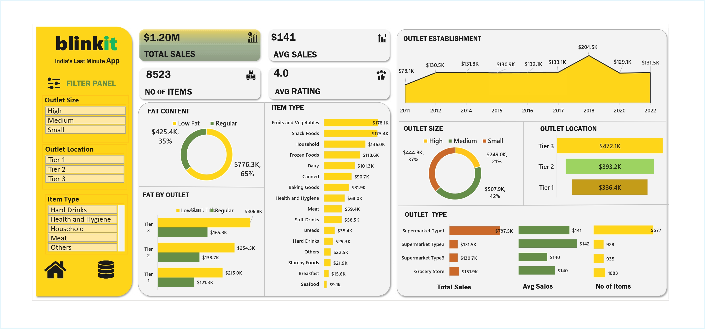

---

# 🛒 Blinkit Sales & Dashboard Analysis (Excel Dashboard)

## 📌 Project Overview

This project presents an **end-to-end sales and operations analysis of Blinkit** using **Microsoft Excel dashboards**.
The objective is to analyze **sales performance, customer satisfaction, and inventory distribution** to uncover actionable insights that can support **business decision-making**.

The analysis is entirely built using **Excel (no BI tools)**, focusing on **KPIs, pivot tables, charts, and dashboard storytelling** — exactly what many analysts do in real business teams.

---

# 📊 Dashboard Preview



---
## 🎯 Business Objective

To conduct a **comprehensive performance analysis** of Blinkit’s:

* Sales trends
* Product categories
* Outlet performance
* Customer ratings
  and identify **optimization opportunities** across outlets and product types.

---

## 📊 Key KPIs Tracked

| KPI                      | Description                     |
| ------------------------ | ------------------------------- |
| **Total Sales**          | Overall revenue generated       |
| **Average Sales**        | Average revenue per transaction |
| **Number of Items Sold** | Total items sold                |
| **Average Rating**       | Customer satisfaction indicator |

---

### 🔍 Analysis Breakdown
---

1️⃣ **Sales by Fat Content:** Compared Low Fat vs Regular products to understand revenue, ratings, and sales volume impact.

2️⃣ **Sales by Item Type:** Identified top- and low-performing product categories based on revenue and customer ratings.

3️⃣ **Fat Content vs Outlet Sales:** Analyzed outlet performance and customer preferences across fat categories.

4️⃣ **Sales by Outlet Establishment:** Evaluated how outlet age/type affects revenue consistency and performance.

5️⃣ **Sales by Outlet Size:** Assessed revenue contribution of Small, Medium, and Large outlets to identify the most profitable size.

6️⃣ **Sales by Outlet Location:** Examined tier-wise geographic performance to highlight high- and low-demand regions.

7️⃣ **Outlet Type Performance:** Compared Total Sales, Average Sales, Items Sold, and Customer Ratings across outlet types.

---

## 🧠 Key Business Insights

* Certain **item categories generate high revenue but lower ratings**, indicating quality or pricing issues
* **Medium-sized outlets** contribute the highest share of total sales
* **Low-fat products** show strong performance in specific outlet types
* Outlet location significantly affects customer buying behavior

---

## 📂 Project Structure

```
📁 Blinkit-Excel-Sales-Dashboard
│── 🛒 blinkit-excel-sales-dashboard
│── 📘 blinkit_dashboard.pdf
│── 🖼️ blinkit_dashboard.jpg
│── 📄 README.md

```

---

## 📈 Why This Project Matters

This project demonstrates:

* Real-world **business analytics thinking**
* Strong **Excel dashboarding skills**
* Ability to translate raw data into **actionable insights**
* Practical understanding of **retail & e-commerce analytics**

---
## 🧑‍💻 Author

**👤 Nayan Mishra**  

📍 Data Analyst | Python Developer | SQL | Power BI | Excel | Data Visualization  

---


